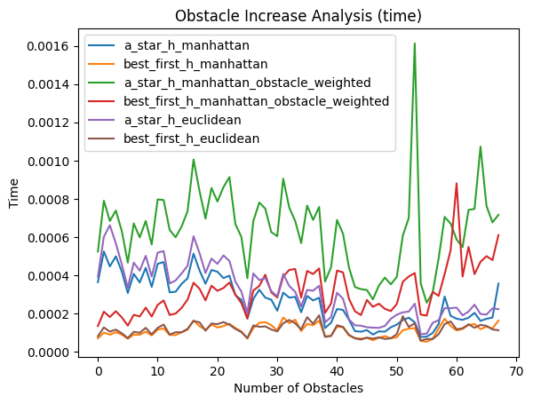
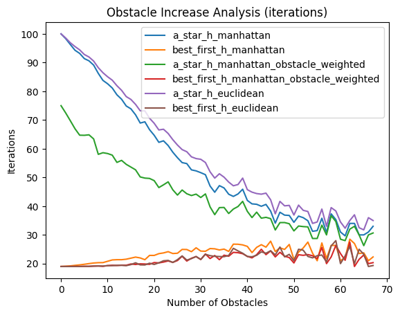
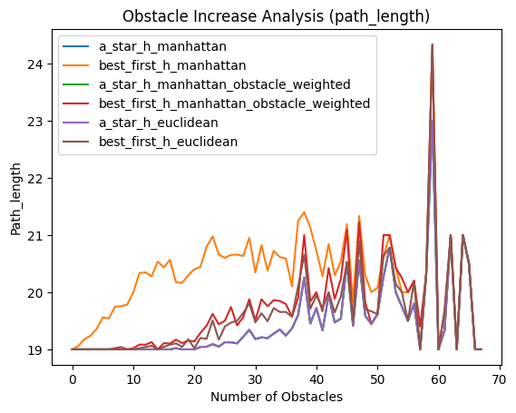

# Homework 1: Heuristic Search

The goal of this homework is to implement heuristic-search based algorithm on the Maze Runner Game.  

## Chosen heuristics

For this purpose, I choose the two following heuristic functions:

- **Manhattan distance**: This heuristic calculates the number of cells between the neighbor $n = (nx, ny)$ and the goal $g = (gx, gy)$.
    The formula is: $$h(n, g) = |nx-gx| + |ny - gy|$$

- **Obstacle-Weighted Manhattan Distance**: This heuristic calculates the number of cells between a neighbor \(n = (nx, ny)\) and the goal \(g = (gx, gy)\), incorporating the distances from \(n\) to the nearest obstacles along the two directions leading to the goal.

    The formula is:
    $$
    h(n, g) = |nx - gx| + |ny - gy| + w \cdot \frac{1}{(d_{1}(n) + d_{2}(n))}
    $$
    where:
  - \(d_{1}(n)\) and \(d_{2}(n)\) are the distances from \(n\) to the nearest obstacles in the directions of the goal.
  - \(w\) is a weight factor that determines the importance of the obstacle component. A smaller $w$ increases the influence of the obstacles in the calculation (default is 0.1).

    For example, if the goal is located in the **up-right** direction relative to the neighbor, the distances to the nearest obstacles in the **up** and **right** directions are included in the computation.
- **Euclidean distance**: This heuristic calculates the euclidean distance between the neighbor $n = (nx, ny)$ and the goal $g = (gx, gy)$.
    The formula is: $$h(n, g) = \sqrt{(nx - gx)^2 + (ny-gy)^2}$$

### Code implementation

```python
def h_manhattan_obstacle_weighted(x, y, env: Environment):
        if env.is_obstacle(x, y):
                return float('inf')

        W = 0.1

        # Get the directions to the goal
        goal_directions = ['right' if env.goal[0] > x else 'left' if env.goal[0] < x else '',
                                        'down' if env.goal[1] > y else 'up' if env.goal[1] < y else '']
        goal_directions = [d for d in goal_directions if d]

        # Get the distances to the obstacles
        obstacle_distances = env.get_distances_from_obstacles(x, y)

        # Compute the heuristic value
        return abs(x - env.goal[0]) + abs(y - env.goal[1]) + sum(W * 1 / obstacle_distances[d] for d in goal_directions)


def h_manhattan(x, y, env: Environment):
        return abs(x - env.goal[0]) + abs(y - env.goal[1])

def h_euclidean(x, y, env: Environment):
        return ((x - env.goal[0]) ** 2 + (y - env.goal[1]) ** 2) ** 0.5        
```

---

## Implemented Algorithms

The algorithms implemented for this homework are:

- **Best First Search**
- **A\* Search**

These two algorithms are implemented in the same function inside the `Agent` class. The primary difference between them lies in the computation of the **g-score**:

- In **A\***, the **g-score** represents the cost from the starting point to the current node. It is incrementally updated as the algorithm progresses.
- In **Best First Search**, the **g-score** is not used. Instead, the algorithm relies solely on the **h-score**, which represents the estimated cost from the current node to the goal.

### Code Implementation

Below is the Python implementation of the shared search logic:

```python
def search(self, algorithm: Literal["best_first", "a_star"]):
        """
        Implements Best First Search and A* Search based on the selected algorithm.

        Args:
                algorithm (Literal["best_first", "a_star"]): Determines whether to use Best First or A*.

        Returns:
                tuple: A reconstructed path to the goal (if found) and the number of iterations performed.
        """
        
        # Priority queue for the frontier
        open_set = PriorityQueue()
        
        # Add the starting point to the frontier
        start = (self.x, self.y)
        open_set.put((0, start))
        
        # Dictionary to track the nodes preceding each node
        came_from = {}
        
        # Set of visited nodes
        visited = set()
        
        # Dictionary to track g-scores
        g_score_dict = {start: 0}
                
        n_iterations = 0    
        
        while not open_set.empty():
                n_iterations += 1
                # Get the node with the lowest priority (the best f-score)            
                _, current = open_set.get()
                x,y = current
                
                # If current is the goal, the path is reconstructed and returned
                if current == self.env.goal:
                        return self.reconstruct_path(came_from, current), n_iterations
                
                # Skip current if it has been already visited
                if current in visited:
                        continue
                
                # Mark the node as visited
                visited.add(current)
                
                # Explore neighbors in the four cardinal directions
                for dx, dy in [(-1,0), (0,1), (1,0), (0,-1)]:
                        neighbor = (x + dx, y + dy)
                        nx, ny = neighbor
                        
                        # Skip the neighbor if it is an edge of the grid or an obstacle
                        if self.env.is_outside(nx, ny) or self.env.is_obstacle(nx, ny):
                                continue
                        
                        # Compute f-score based on the selected algorithm
                        g_score = 0 if algorithm == "best_first" else g_score_dict.get(current, float('inf')) + 1
                        h_score = self.heuristic(nx, ny, self.env)
                        f_score = h_score + g_score
                        
                        
                        # Update the neighbor's g-score if it's a better path or the node hasn't been visited
                        if neighbor not in g_score_dict or g_score < g_score_dict[neighbor]:
                                g_score_dict[neighbor] = g_score
                                open_set.put((f_score, neighbor))
                                came_from[neighbor] = current
                        
                                
        # If no path is found, return None  
        return None, None
```

---

## Environment

The grid maze environment is implemented in the `Environment` class. This class allows you to define the maze's **width**, **height**, and the **number of obstacles** during initialization. The grid is then created with obstacles randomly distributed across it.

### Initialization

The `__init__` method sets up the grid with the following key elements:

- **Spawn Point**: The starting position, fixed at the top-left corner \((0, 0)\).
- **Goal**: The target position, fixed at the bottom-right corner \((width-1, height-1)\).
- **Grid**: A 2D list representing the maze.
- **Obstacles**: A list storing the coordinates of the obstacles, which are generated using the `generate_obstacles` method.

#### Code

```python
def __init__(self, width, height, n_obstacles):
        self.width = width
        self.height = height
        self.spawn_point = (0, 0)
        self.goal = (width - 1, height - 1)
        
        self.grid = [[0 for _ in range(width)] for _ in range(height)]
        self.obstacles = []
        
        self.generate_obstacles(n_obstacles)

def generate_obstacles(self, n=100):
        for _ in range(n):
                while True:
                        x = random.randint(0, self.width - 1)
                        y = random.randint(0, self.height - 1)
                        if (x, y) != self.spawn_point and (x, y) != self.goal:
                                break
                self.obstacles.append((x, y))
                self.grid[y][x] = 1

```

### Utility functions

The Environment class also includes several utility functions to interact with the grid and provide information to the agent:

1. **Distance to Obstacles**
This function calculates the distance from a given cell $(x,y)$ to the nearest obstacle in the four cardinal directions: left, up, right, and down.

    ```python
        def get_distances_from_obstacles(self, x, y):
                distances = {
                        'left': x,
                        'up': y,
                        'right': self.width - x - 1,
                        'down': self.height - y - 1
                }
                
                for ox, oy in self.obstacles:
                        if oy == y:
                                if ox < x:
                                        distances['left'] = min(distances['left'], x - ox)
                                elif ox > x:
                                        distances['right'] = min(distances['right'], ox - x)
                        elif ox == x:
                                if oy < y:
                                        distances['up'] = min(distances['up'], y - oy)
                                elif oy > y:
                                        distances['down'] = min(distances['down'], oy - y)
                
                return distances
    ```

2. **Check if a Cell is an Obstacle**
This function returns True if a given cell $(x,y)$ contains an obstacle, otherwise False.

    ```python
        def is_obstacle(self, x, y):
                return self.grid[y][x] == 1
    ```

3. **Check if a Cell is Outside the Grid**
This function checks whether a given cell $(x,y)$ lies outside the boundaries of the grid.

    ```python
        def is_outside(self, x, y):
                return x < 0 or y < 0 or x >= self.width or y >= self.height
    ```

### Pygame visualization

The environment also provides a visualization function to display the execution of the found path. As the agent moves through the grid, the cells it has already visited are highlighted in orange, and the grid updates dynamically to reflect the agent's progress.

```python
def show_maze(self, agent):
        """
        Visualizes the grid maze and the agent's execution path using Pygame.
        
        Args:
            agent: The agent object containing its current position and visited cells.
        """
        # Initialize Pygame
        pygame.init()
        screen = pygame.display.set_mode((self.width * 20, self.height * 20))
        pygame.display.set_caption("Grid Maze")
        
        # Fill the screen with a white background
        screen.fill((255, 255, 255))

        # Draw the grid and its components
        for y in range(self.height):
            for x in range(self.width):
                if self.grid[y][x] == 1:  # Obstacle
                    color = (0, 0, 0)
                elif (x, y) == self.goal:  # Goal
                    color = (0, 255, 0)
                elif (x, y) == self.spawn_point:  # Spawn point
                    color = (255, 0, 0)
                elif (x, y) in agent.visited_cells:  # Visited cells
                    color = (255, 165, 0)  # Orange
                else:  # Empty cells
                    color = (255, 255, 255)
                
                # Draw the cell and its border
                pygame.draw.rect(screen, color, pygame.Rect(x * 20, y * 20, 20, 20))
                pygame.draw.rect(screen, (0, 0, 0), pygame.Rect(x * 20, y * 20, 20, 20), 1)
        
        # Draw the agent's current position
        pygame.draw.rect(screen, (0, 0, 255), pygame.Rect(agent.x * 20, agent.y * 20, 20, 20))
        
        # Update the display
        pygame.display.flip()

        # Handle events to prevent freezing
        for event in pygame.event.get():
            if event.type == pygame.QUIT:
                pygame.quit()
                return
```

### Key Features

1. **Dynamic Grid Visualization**: The grid updates in real-time to reflect the agent's movements.
2. **Color Coding**:
        - **Red**: Spawn point.
        - **Green**: Goal.
        - **Black**: Obstacles.
        - **White**: Empty cells.
        - **Orange**: Visited cells.
        - **Blue**: Current position of the agent.
3. **Clear Borders**: Each cell is outlined with a black border for better visualization.

This function leverages Pygame to create an interactive and visually clear representation of the agent's pathfinding progress, making it easier to analyze and debug the execution.

---

## Comparative Analysis

This section presents comparative statistics to analyze the performance of different combinations of algorithms and heuristics as the number of obstacles increases. The goal is to evaluate how these combinations affect the ability to find a path to the goal.

For the analysis:

- The maximum number of obstacles is set to 100.
- Each combination of heuristic and algorithm is tested 100 times for each obstacle count.

The increase in the number of obstacles is halted when, for a certain value, all 100 iterations fail to find a path to the goal. This indicates that the grid has become saturated with obstacles, making it pointless to continue adding more.

### Observations
<div style="display: flex; justify-content: center; gap: 3px; margin: 10px; flex-wrap: wrap">
        
        
        
</div>


1. **Time**
        - Heuristics that consider obstacles generally require more execution time for the algorithm. Another consideration is that the A* requires more time that the BFS, in general.
    

2. **Iterations**
        - While the obstacle-weighted heuristic takes longer to execute, it typically results in fewer iterations.
        - As the number of obstacles decreases, efficiency of **A\*** decreases.

3. **Path Length (Optimality)**
        - When using the **A\*** algorithm, the path length remains consistent regardless of the heuristic applied.
        - For **BFS**, the obstacle-weighted heuristic tends to produce slightly more optimal paths compared to the classic manhattan heuristic, but the best seems to be the euclidean one.

These insights highlight the trade-offs between time, iteration count, and path optimality when selecting a heuristic and algorithm for pathfinding in obstacle-rich environments.
