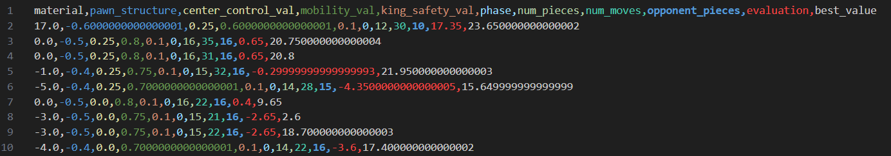

# Homework 2: MinMax algorithms

The goal of this homework is to implement different kinds of MinMax algorithms, applying them on a choosen game. For my project, I choose the chess game.

## Chess implementation
To implement these algorithms, I used a chess game I found on GitHub ([repository at this link](https://github.com/mandrelbrotset/pygame-chess)) that already included complete logic for piece movements and gameplay, along with a graphical representation of the matches.
<div style="display: flex; justify-content: center; gap: 10px; margin: 20px;">
    
    
    
</div>

The original implementation only supported Player vs. Player (PvP) mode. My objective was to enhance it by adding logic to enable players to compete against an AI or to watch two AIs play against each other.

For the pourposes of my project, I had to do some refactoring on the classes of the original repository, in order to allow an AI player to perform the moves. 

#### Chess Constructor
In the constructor method of the class Chess, I pass the ```ai_players``` dictionary, which contains the two objects of the class Player that will play the match. This dictionary is structured with a key that is the color of the player and a value that is the player itself. Into the constructor, I set these two players as in the following:

```python

    # define engines for the AI players
    self.num_players = 2 - len(ai_players)
    match self.num_players:
        case 0:
            
            self.white_player = ai_players["white"]
            self.white_player.set_chess(self)
            
            # self.white_player = Player(self, "white", Algorithms.BRANCHING_LIMIT, "standard", False)
            self.black_player = ai_players["black"]
            self.black_player.set_chess(self)
            
        case 1:
            self.black_player = Player(self, "black", Algorithms.BRANCHING_LIMIT, "standard", False)
            
```

#### Turn logic
In the method `play_turn`, the player was originally prompted to select the piece to move and then choose the square to move the piece to from the available options. I modified this method to also handle the decision-making process for AI players. Below is an example of how this method works for the black player:


```python
destination_move = None
if (self.turn["black"]):
    if self.black_player:
        _, board = self.black_player.choose_move(
            self.piece_location,
        )

        piece_name, piece_color, (source_coordinates), (
            destination_coordinates) = self.black_player.move_to_the_board[json.dumps(board)]

        source_move = (piece_name, piece_color, source_coordinates)
        destination_move = ("", "", destination_coordinates)

        self.move_piece("black", source_move)

    self.move_piece("black", destination_move)
```
First, there is `self.black_player`, which detects if the player is the AI. In such cases, the method `choose_move`, which we will explore later, returns the best possible board among all those reachable with a single move. The move required to reach this board is then retrieved from a dictionary contained within the `Player` object and passed to the `move_piece` method in two steps:

1. **First Step**: `self.move_piece("black", source_move)`  
   The arguments are the player's color and the current coordinates of the chosen piece.

2. **Second Step**: `self.move_piece("black", destination_move)`  
   The arguments are the player's color and the target coordinates where the piece will be moved.

This two-step mechanism was part of the original chess repository and was implemented to manage the game's listening status for player input.

#### Generating Next Boards
The logic to generate all one-step reachable boards from the current board was not implemented. To achieve this, I added a method that operates in two steps:

1. Retrieve all possible moves for the player's pieces on the board.
2. Simulate each move to produce the resulting board.

The first step was already implemented, so I focused on creating a method to handle the simulation of the moves.


```python

def simulate_move(self, piece_name, piece_coordinates, move, current_board):
    # Create a copy of the board to preserve the original state
    new_board = {col: {row: cell.copy() for row, cell in rows.items()}
                for col, rows in current_board.items()}

    # Locate the current position of the piece based on its coordinates
    current_position = None
    for column, rows in current_board.items():
        for row, cell in rows.items():
            if cell[0] == piece_name and cell[2] == piece_coordinates:
                current_position = (column, row)
                break
        if current_position:
            break

    if not current_position:
        raise ValueError(f"Piece {piece_name} with coordinates {piece_coordinates} is not on the board.")

    # Find the new position based on the move coordinates
    new_position = None
    for column, rows in current_board.items():
        for row, cell in rows.items():
            if cell[2] == move:
                new_position = (column, row)
                break
        if new_position:
            break

    if not new_position:
        raise ValueError(f"Move {move} is invalid.")

    # Update the piece's position
    current_column, current_row = current_position
    new_column, new_row = new_position

    # Remove the piece from its current position
    new_board[current_column][current_row][0] = ''
    new_board[current_column][current_row][1] = False

    # Place the piece in its new position
    new_board[new_column][new_row][0] = piece_name
    new_board[new_column][new_row][1] = True

    return new_board

```
#### Random configuration

To have better results in further analysis, it was important to start the matches simulations from different states of the board. In order to do this, I implemented a method to randomically choose one of the possible moves for each player, according to the `number_of_moves` argunment passed to the method.

```python
def random_configuration(self, number_of_moves):

    current_board = self.piece_location
    player_color = "white"

    for _ in range(number_of_moves):
        children = self.get_children_boards(player_color, current_board)
        current_board = random.choice(children)
        player_color = "black" if player_color == "white" else "white"

    self.piece_location = current_board
```

---

## Player class
The player class was the key point to maintain the MinMax algorithms class independent from the game module. The player is encharged to get the current state from the `Chess` module and then call the `MinMax` engine saying it how to evaluate a state and how to get the children state, in order to select the best state to reach. Thanks to this managing of the states, the MinMax module can work without knowing the structure of the state, of the get_children function and of the evaluate function.

#### Player Constructor
The constructor defines all the player's characteristics, such as the type of MinMax algorithm used and the heuristic. It also includes the `self.move_to_the_board` dictionary, which maps the board to the move required to reach it, as mentioned earlier. Additionally, there is a deque that stores the last 16 moves to detect cycles and declare a draw in the game. Finally, if the `statistics_mode` flag is set to true, certain statistics are stored within the Player object.


```python
def __init__(self, color: Literal["white", "black"], algorithm: Algorithms, engine_params: dict, 
                                                    heuristic: Literal["MA", "SEF"], statistics_mode=False):
    self.color = color
    self.heuristic = heuristic
    self.algorithm = algorithm
    self.engine_params = engine_params

    # Dictionary to store the move that leads to a specific board state
    self.move_to_the_board = {}

    # Deque to store the last 16 moves
    self.last_moves = deque(maxlen=16)

    # Statistics
    self.statistics_mode = statistics_mode
    if statistics_mode:
        # Number of moves for each possible number of pieces on the board
        self.completed_moves_per_npieces = {i: 0 for i in range(
            1, MAX_NUM_OF_PIECES + 1)}
        self.move_times_per_npieces = {
            i: 0 for i in range(1, MAX_NUM_OF_PIECES + 1)}

        # Number of moves for each possible number of available moves
        self.completed_moves_per_nmoves = {}
        self.move_times_per_nmoves = {}

```

The `set_chess` method is an extension of the constructor, separated for analytical purposes. By detaching the chess logic from the constructor, the system's main method can first declare the players and then assign them to the chess object. In the chess constructor, the chess object is subsequently passed to the players.

This method sets the critical functions for the `MinMax` algorithm that are game-dependent. Assigning these functions in this way ensures that the `MinMax` module remains "game-independent," as mentioned earlier. Once this setup is complete, the `MinMax` engine is created and linked to the `Player` object.


```python
def set_chess(self, chess):
    self.chess = chess

    # Dynamically assign evaluate based on heuristic
    self.evaluate = lambda board: self.combined_evaluation(
        self.color if self.engine.maximizing_player else (
            "black" if self.color == "white" else "white"),
        board,
    )

    # Get children lambda function
    self.get_children = lambda board: self.chess.get_children_boards(
        self.color if self.engine.maximizing_player else (
            "black" if self.color == "white" else "white"),
        board
    )

    self.engine = MinMax(self.get_children, self.evaluate, self.algorithm)
```

The engine is invoked by the `choose_move` method to make the move decision.
```python
def choose_move(self, board):
    return self.engine.engine(board, **self.engine_params) 
```

#### Cycle detection
To detect a draw situation, I implemented a mechanism to identify cycles in the moves. With this mechanism, if a player becomes stuck in a repetitive cycle of moves, a draw is declared, and the match is concluded.

```python
def detect_cycle(self, cycle_length):
    # Check if there are enough moves to verify a cycle
    if len(self.last_moves) < cycle_length * 2:
        return False

    # Compare the first half with the second half
    moves_len = len(self.last_moves)
    offset = moves_len - cycle_length * 2

    # Compare the first half with the second half
    return all(
        self.last_moves[i + offset] == self.last_moves[i + offset + cycle_length]
        for i in range(cycle_length)
    )
```

This method is invoked in the `Chess` class:

```python
if any(self.black_player.detect_cycle(cycle_length=i) for i in range(2, 8)):
    self.winner = "Draw"
```

#### Evaluation functions
To evaluate the state of the board, two different heuristics were implemented: **Material Advantage (MA)** and **Simplified Evaluation Function (SEF)**.

##### Material Advantage (MA)
The Material Advantage heuristic is calculated as the weighted sum of all the pieces available for a player minus the weighted sum of all the pieces of the opponent. The weights assigned to each type of piece are as follows:
\[PV = \begin{cases} "pawn": 1,\\ "knight": 3,\\ "bishop": 3,\\ "rook": 5,\\ "queen": 9,\\ "king": 20 \end{cases}\]
And the value is calculated as:
\[
\text{MA} = \sum_{p \in P_{\text{player}}} \text{PV}[p] - \sum_{p \in P_{\text{opponent}}} \text{PV}[p]
\]

Where:
- \( P_{\text{player}} \) is the set of all the player's pieces on the board.
- \( P_{\text{opponent}} \) is the set of all the opponent's pieces on the board.
- \(\text{PV}[p]\) gives the weight assigned to the piece \( p \).

This formula provides a quantitative evaluation of the player's material advantage over the opponent.

##### Simplified Evaluation Function (SEF)

The Simplified Evaluation Function (SEF) evaluates the board state by combining multiple factors that contribute to a player's advantage or disadvantage. The evaluation considers five key components:

1. **Material (M)**  
   The material value is the weighted sum of the player's pieces minus the weighted sum of the opponent's pieces, as explained below.
2. **Pawn Structure Penalty (P)**  
    Penalizes weaknesses in the pawn structure, including doubled, isolated, or backward pawns:
    - **Doubled pawns:** A penalty of \( -0.5 \) is applied for each additional pawn in the same file.
    - **Isolated pawns:** A penalty of \( -0.5 \) is applied when no pawns are in adjacent files.

3. **Center Control (C)**  
    Rewards pieces controlling the central squares \((3, 3), (3, 4), (4, 3), (4, 4)\). Each controlled square adds \( +0.5 \) to the score:

    \[
    C = \sum_{p \in P_{\text{player}}} 0.5 \quad \text{if } \text{piece coordinates} \in \{(3,3), (3,4), (4,3), (4,4)\}
    \]

4. **Mobility (Mv)**  
    Rewards the number of legal moves available to the player. Each legal move contributes \( +0.1 \):

    \[
    Mv = 0.1 \times \text{number of legal moves}
    \]

5. **King Safety (Ks)**  
    Rewards the king's safety by counting the number of safe adjacent squares. Each safe square adds \( +0.2 \):

    \[
    Ks = 0.2 \times \text{number of safe adjacent squares}
    \] 
    If the king is missing, a severe penalty of \( -100 \) is applied.


The final evaluation score is computed as a weighted sum of the above components. The weights depend on the phase of the game (opening, middlegame, endgame):


| Phase      | Material | Pawn Structure | Center Control | Mobility | King Safety |
|------------|----------|----------------|----------------|----------|-------------|
| Opening    | 1.0      | 0.2            | 0.5            | 0.5      | 0.1         |
| Middlegame | 1.0      | 0.3            | 0.3            | 0.4      | 0.3         |
| Endgame    | 1.5      | 0.2            | 0.1            | 0.2      | 0.5         |

The total score is calculated as:

\[
\text{SEF} = M \cdot w_M + P \cdot w_P + C \cdot w_C + Mv \cdot w_{Mv} + Ks \cdot w_{Ks}
\]

Where \( w \) represents the weights for each component based on the game phase.

## MinMax class

As already said, the main goal for the MinMax class is to make it as game-independent as possible. To do that, the two main functions (`get_children` and `H_0`) are passed in the constructor as seen earlier:

```python

def __init__(self, get_children: Callable, evaluate: Callable, engine: Algorithms):
    self.maximizing_player = None
    self.get_children = get_children
    self.H_0 = evaluate

    match engine:
        case Algorithms.MIN_MAX:
            self.engine = self.minmax
        case Algorithms.FAIL_HARD_ALPHA_BETA:
            self.engine = self.fhabminmax
        case Algorithms.FAIL_SOFT_ALPHA_BETA:
            self.engine = self.fsabminmax
        case Algorithms.BRANCHING_LIMIT:
            self.engine = self.blminmax
        case Algorithms.PRED_BLMINMAX:
            self.engine = self.pred_blminmax
        case Algorithms.MULTI_INPUT_PRED_BLMINMAX:
            self.engine = self.mi_pred_blminmax
        case _:
            raise ValueError(
                F"Invalid engine type. Choose between {', '.join([engine.value for engine in Algorithms])}")

```
---
### Implemented MinMax Algorithms

The class includes several implementations of the MinMax algorithm. Each algorithm incorporates a stochastic method for selecting the best child when multiple children share the same optimal value. This approach helps reduce draw situations and introduces variability in the scenarios, all while preserving the quality of the best move. 

The `L` parameter in each algorithm represents the maximum depth to which the algorithms evaluate the children.

#### MinMax
This is the classic MinMax algorithm without any pruning.


```python
def minmax(self, state, L, maximizing_player=True):
    # Update the current player
    self.maximizing_player = maximizing_player

    # Store the children to avoid redundant calculations
    children = self.get_children(state)

    # Terminal condition: depth is zero or no children remain
    if L == 0 or not children:
        return self.H_0(state), state

    # Initialize the best value and the best node
    best_value = float('-inf') if maximizing_player else float('inf')
    best_children = []

    # Iterate through the children
    for child in children:
        child_value, _ = self.minmax(child, L - 1, not maximizing_player)

        if maximizing_player:
            if child_value > best_value:
                best_value = child_value
                best_children = [child]
            elif child_value == best_value:
                best_children.append(child)
        else:
            if child_value < best_value:
                best_value = child_value
                best_children = [child]
            elif child_value == best_value:
                best_children.append(child)

    # Choose a random child among those with the best value
    best_child = random.choice(best_children) if best_children else None

    return best_value, best_child
```

#### MinMax with Soft and Hard Alpha-Beta Pruning

This version of the MinMax algorithm incorporates pruning based on the Alpha-Beta concept. The distinction between Soft and Hard pruning lies in the type of inequality used for pruning:

- **Soft Alpha-Beta Pruning**: Pruning is performed using non-strict inequalities (≤, ≥).  
- **Hard Alpha-Beta Pruning**: Pruning is performed using strict inequalities (<, >).

I paste only the code for the Soft Alpha-Beta MinMax:

```python
def fsabminmax(self, state, L, alpha=float('-inf'), beta=float('inf'), maximizing_player=True):
    # Update the current player
    self.maximizing_player = maximizing_player

    children = self.get_children(state)

    # Terminal condition: depth is zero or no children remain
    if L == 0 or not children:
        return self.H_0(state), state

    # Initialize the best value and the best nodes
    best_value = float('-inf') if maximizing_player else float('inf')
    best_children = []

    # Iterate through the children
    for child in children:
        child_value, _ = self.fsabminmax(
            child, L - 1, alpha, beta, not maximizing_player)

        if maximizing_player:
            if child_value > best_value:
                best_value = child_value
                # Reset the list of best children
                best_children = [child]
            elif child_value == best_value:
                # Add the child with the same value
                best_children.append(child)
            alpha = max(alpha, best_value)
        else:
            if child_value < best_value:
                best_value = child_value
                # Reset the list of best children
                best_children = [child]
            elif child_value == best_value:
                # Add the child with the same value
                best_children.append(child)
            beta = min(beta, best_value)

        if beta <= alpha:
            break  # Beta pruning

    # Choose a random child among those with the best value
    best_child = random.choice(best_children) if best_children else None

    return best_value, best_child
```

#### MinMax Soft Alpha-Beta (SAB) with Branch Limit (BL)

In this version, instead of exploring all the children of the current state, the children are sorted from the most promising to the least promising based on the $H^l$ evaluation. This evaluation uses the same MinMax algorithm with a specified lookahead depth $l$.

The `effective_l` parameter represents the actual lookahead depth, which cannot exceed the maximum depth `L`. This ensures the calculation achieves the maximum possible lookahead within the `L` limit.

The branching factor `BF` determines the number of the best children to be explored.

```python
def blminmax(self, state, L, l=0, BF=10, alpha=float('-inf'), beta=float('inf'), maximizing_player=True):

    self.maximizing_player = maximizing_player

    children = self.get_children(state)

    # Terminal condition
    if L == 0 or not children:
        return self.H_0(state), state

    best_value = float('-inf') if maximizing_player else float('inf')
    best_children = []

    # Determine the effective lookahead depth
    effective_l = max(0, l - (L - 1)) if l > 0 else 0

    # Evaluate children
    evaluated_children = []
    for child in children:
        if effective_l > 0:
            # Use a reduced-depth lookahead
            value = self.blminmax(child, effective_l, l=0, BF=BF, alpha=alpha, beta=beta, 
                                                        maximizing_player=not maximizing_player)[0]
        else:
            # Use the static evaluation
            value = self.H_0(child)
        evaluated_children.append((child, value))

    # Sort children based on the calculated value and limit the number of children
    evaluated_children.sort(key=lambda x: x[1], reverse=maximizing_player)
    limited_children = evaluated_children[:min(BF, len(children))]

    # Iterate over the limited children
    for child, _ in limited_children:
        child_value, _ = self.blminmax(child, L - 1, l, BF, alpha, beta, not maximizing_player)

        if maximizing_player:
            if child_value > best_value:
                best_value = child_value
                best_children = [child]
            elif child_value == best_value:
                best_children.append(child)
            alpha = max(alpha, child_value)
        else:
            if child_value < best_value:
                best_value = child_value
                best_children = [child]
            elif child_value == best_value:
                best_children.append(child)
            beta = min(beta, child_value)

        if beta <= alpha:
            break  # Pruning

    # Choose a random child among those with the best value
    best_child = random.choice(best_children) if best_children else None

    return best_value, best_child
```


#### MinMax SAB BL with optimal lookahead


To determine the optimal lookahead, I fixed the depth \( L \) to 4 and experimented with different values of \( l \) ranging from 0 to \( L-1 \). 


To perform this test efficiently and support high values of \( L \), the `blminmax` method underwent two major improvements: **parallelization** and **caching**.

###### Parallelization

Parallelization was implemented using `ThreadPoolExecutor` to evaluate \( H^l \) for the children of the state in parallel. This significantly reduced computation time.

```python
def evaluate_child(child):
    if effective_l > 0:
        return child, self.blminmax(child, effective_l, l=0, BF=BF, alpha=alpha, beta=beta,         
                                    maximizing_player=not maximizing_player)[0]
    else:
        return child, self.H_0(child)

with ThreadPoolExecutor() as executor:
    evaluated_children = list(executor.map(evaluate_child, children))
```

###### Caching with a Transposition Table

Caching was implemented using a transposition table. Each time the algorithm starts to find a move, the transposition table is initialized:

```python
if self.starting_L is None:
    self.starting_L = L
    self.transposition_table = {}
```

The current state, along with the parameters (\( L \), \( l \), \( BF \), and `maximizing_player`), is used as the key for a dictionary. The value stored is a tuple containing `best_child` and `best_value`:

```python
try:
    state_key = (hash(state), L, l, BF, maximizing_player)
except TypeError:
    state_key = (hash(str(state)), L, l, BF, maximizing_player)  # Fallback for unhashable states
# ...
# After the calculation...
# ...
result = (best_value, best_child)
self.transposition_table[state_key] = result
```

If the `state_key` is already present in the transposition table, the algorithm skips the computation and directly returns the stored values:

```python
if state_key in self.transposition_table:
    return self.transposition_table[state_key]
```


These enhancements allowed for more efficient testing and execution of the `blminmax` algorithm while handling high values of \( L \) effectively.

###### Future Improvements
An effective improvement for this analysis could involve randomizing the engine used for the opponent. With this approach, the win rate would likely decrease since the opponent's strength level could vary.

#### Pred BLMinMaxl

After identifying the optimal lookahead, I used the combination of \( L \) and \( optimal\_l \) to build a dataset. The dataset was constructed in the following way: each time a move was chosen, the tuple \((H_0(state), H_L(state))\) was saved in the dataset.

<div style="display: flex; justify-content: center; gap: 10px; margin: 20px;">
    
</div>


Using this dataset, I trained a `RandomForestRegressor` to predict \( H_L \) given \( H_0 \). Through grid search, I identified the best values for some hyperparameters and fine-tuned the model.

```python
# Split dataset into features (X) and target (y)
X = data.drop(columns=['best_value'])
y = data['best_value']

# Train-test split
X_train, X_test, y_train, y_test = train_test_split(X, y, test_size=0.2, random_state=42)

# Define the model
rf_model = RandomForestRegressor(random_state=42)

# Hyperparameter tuning with GridSearchCV
param_grid = {
    'n_estimators': [50, 100, 200],
    'max_depth': [5, 10, 20, None],
    'min_samples_split': [2, 5, 10],
    'min_samples_leaf': [1, 2, 4]
}

grid_search = GridSearchCV(estimator=rf_model, param_grid=param_grid, cv=5,
                            scoring='neg_mean_squared_error', verbose=2, n_jobs=-1)
grid_search.fit(X_train, y_train)
```

The following results were obtained on the test set:

```bash
Best Parameters:  {'max_depth': 5, 'min_samples_leaf': 4, 'min_samples_split': 10, 'n_estimators': 200}
Train MSE:  78.4351496123083
Test MSE:  84.17281661087253
Test MAE:  7.664332889161043
Test R^2:  0.6925199664191655
```

The model is used to choose the best child among the children of a node as shown in the following code:

```python
def pred_blminmax(self, state):
    if not self.model:
        self.model = joblib.load('model_L4_l1.pkl')
    self.maximizing_player = True
    
    children = self.get_children(state)
    
    if not children:
        return self.H_0(state), state
    
    child_values = []
    for child in children:
        import pandas as pd
        child_value = self.model.predict(pd.DataFrame([[self.H_0(child)]], columns=['evaluation']))[0]
        child_values.append((child, child_value))
    
    
    # Find the child and its value with the maximum predicted value
    best_child, best_value = max(child_values, key=lambda x: x[1])
        
    return best_value, best_child  # Return both the value and the corresponding child

```


#### Multi Input (MI) Pred BLMinMaxl

As with the standard Pred BLMinMaxl, I first created a dataset containing the same data as the previous version, supplemented with additional state evaluations such as the number of pieces, material advantage, king's safety, and other metrics.

<div style="display: flex; justify-content: center; gap: 10px; margin: 10px;">
    
</div>


Using this dataset, I trained an `MLPRegressor` to predict \( H_L \) based on all the features. Through grid search, I determined the optimal hyperparameters, including the number of layers, and fine-tuned the model for improved performance.


```python
# Split dataset into features (X) and target (y)
X = data.drop(columns=['best_value'])
y = data['best_value']

# Train-test split
X_train, X_test, y_train, y_test = train_test_split(X, y, test_size=0.2, random_state=42)

# Define the model
rf_model = RandomForestRegressor(random_state=42)

# Hyperparameter tuning with GridSearchCV
param_grid = {
    'n_estimators': [50, 100, 200],
    'max_depth': [5, 10, 20, None],
    'min_samples_split': [2, 5, 10],
    'min_samples_leaf': [1, 2, 4]
}

grid_search = GridSearchCV(estimator=rf_model, param_grid=param_grid, cv=5, scoring='neg_mean_squared_error', verbose=2, n_jobs=-1)
grid_search.fit(X_train, y_train)
```
And I unexpectedly achieved metrics that were very similar to the previous version:

```bash
Best Parameters:  {'activation': 'relu', 'alpha': 0.0001, 'hidden_layer_sizes': (100, 100, 100, 100), 
'learning_rate': 'constant', 'solver': 'adam'}
Train MSE:  64.10929811264945
Test MSE:  85.65873731752093
Test MAE:  7.1606132757868535
Test R^2:  0.6974346650262335
```
As in the previous version, the model is used in the following way:

```python
def mi_pred_blminmax(self, state, features, features_names):
    if not self.model:
        self.model = joblib.load('mlp_model_L4_l1.pkl')
    
    self.maximizing_player = True
    
    children = self.get_children(state)
    
    if not children:
        return self.H_0(state), state
    
    child_values = []
    for child in children:
        import pandas as pd
        child_value = self.model.predict(pd.DataFrame([features], columns=features_names))[0]
        child_values.append((child, child_value))
        
    
    # Find the child and its value with the maximum predicted value
    best_child, best_value = max(child_values, key=lambda x: x[1])
    
    return best_value, best_child
```

---

## Analysis Outputs

### Part 1: Comparison of abMinMax and blMinMax

This section focuses on the comparison between `abMinMax` and `blMinMax`. In the plots below, you can observe comparisons between the following algorithms:

- `MinMax`
- `fsabMinMax`
- `fhabMinMax`
- `blMinMax` with `l=0`

These algorithms were evaluated against an opponent employing `Material Advantage` and `blMinMax` with `L=2, BF=5, l=0`. The **results** are presented below:


**Analysis**:
The results show that, as expected, the more the algorithm is pruned and optimized, the lower its win rate. However, there is a surprising outcome: while `MinMax` was predicted to have the highest win rate due to its lack of pruning, the algorithm with the highest win rate turned out to be `fhabMinMax`. Regarding execution times, all results align with expectations.


### Part 2: Comparison of blMinMax with Different Lookaheads

This section examines the performance of `blMinMax` with varying lookaheads. The plots illustrate comparisons for the following lookahead values:

- `l=0`
- `l=1`
- `l=2`
- `l=3`

All evaluations were performed with `L=4`, pitting `blMinMax` against an opponent using `fsabMinMax` with `L=2`. A total of 100 games were run, and the **results** are as follows:


**Simulation Times**:

- **`l=0`**: 08:23 (5.03 seconds per match)
- **`l=1`**: 52:56 (31.77 seconds per match)
- **`l=2`**: 1:32:00 (55.20 seconds per match)
- **`l=3`**: 1:49:45 (65.85 seconds per match)

**Optimal Lookahead**:
The optimal lookahead, based on these results, is **`l=1`**, as it achieves a good balance between execution time and a win rate comparable to higher values of `l`.

### Part 3 and 4: Predictive MinMax

This section compares the performance of `blMinMax` (L=4, BF=2, l=1), `predMinMax`, and `MIpredMinMax`.


**Analysis**:
The `predMinMax` algorithm shows better results compared to `blMinMax`, while `MIpredMinMax` exhibits an unusual behavior characterized by a high number of draws and no wins. This could be due to the model or feature set requiring further tuning.

Upon analyzing the matches, it appears that the algorithm adopts a highly defensive strategy, often leading to repetitive cycles (draws) or losses without any offensive moves to challenge the opponent.

## Conclusion

This homework has been highly stimulating and instructive, showcasing the differences between algorithms through a practical approach. We delved into real-world challenges of computational complexity and the need to find optimizations and trade-offs to achieve better performance, even at the cost of some effectiveness.

