# The Cooking Chef Problem

This report describes the implementation of the Cooking Chef Problem, highlighting the key aspects and challenges encountered during the process. 

    

<em>Instructions map representation</em>

The Cooking Chef Problem involves developing an intelligent agent capable of efficiently managing a kitchen environment, optimizing the preparation and cooking of various dishes. This report covers the following points:

1. **Model Definition**: An overview of the Cooking Chef Problem world model, including the states, actions, dynamics, and rewards.
2. **Implementation Details**: A step-by-step explanation of the key parts of the implementation process.
3. **Challenges and Solutions**: An analysis of the challenges faced during the implementation and the solutions devised to overcome them.
4. **Results and Evaluation**: Presentation of the results obtained from the implemented solution and an evaluation of its performance.

---

## Model Definition

Although the instructions require creating a model-free agent, the model must be represented within the environment. Specifically, it is represented as a Markov Decision Process, which includes:
- **S**: set of states.
- **A**: set of actions.
- **P**: transition/dynamics probability function.
- **R**: rewards function.
- **$\gamma$**: discount factor.

### 1. States

The **states** are defined as a triple consisting of:
1. **x-coordinate** on the map.
2. **y-coordinate** on the map.
3. **CookingState (CS)**, which can be one of the following:
   - **EB_FOR_SCRAMBLED**: The agent is searching for the Egg Beater to cook scrambled eggs.
   - **EB_FOR_PUDDING**: The agent is searching for the Egg Beater to cook pudding.
   - **PAN**: The agent is searching for the Pan.
   - **OVEN**: The agent is searching for the Oven.

The **COOKING** state is not implemented, as it is implicit in other states: when the agent is in the `PAN` or `OVEN` state and reaches one of these instruments, the execution is considered finished. Consequently, the total *number of states* in this model is given by:
$$
|S| = \text{map\_height} \cdot \text{map\_width} \cdot 4.
$$

### 2. Actions

The **actions** available to the agent are:
- **UP**: The agent moves up.
- **DOWN**: The agent moves down.
- **LEFT**: The agent moves left.
- **RIGHT**: The agent moves right.
- **OTHER_SIDE**: The agent attempts to move to the other side of a gate.

The **OTHER_SIDE** action represents the intention to cross to the other side of a gate. However, it can only be executed when the agent is on a gate; this restriction is enforced through the dynamics. It is trivial to note that the total number of actions is:
$$
|A| = 5.
$$

### 3. Dynamics

The dynamics are perhaps the most crucial part of the modeling process: they define how actions can be applied to the world and how the world reacts to them. Since it is not feasible to represent every combination of State, Action, and Next State in this report (as the number of combinations is $|S| \cdot |A| \cdot |S|$), the dynamics are instead summarized by defining the primary rules. Let `a` be the chosen action and `s` the current state. The following rules apply:

- **If `a = OTHER_SIDE` and `s` is not a gate**, then the next state remains equal to `s` (the agent cannot move). Otherwise, the next state will have the same CS but with the position updated to the other gate.
- **If `a` is a direction and there is a wall in that direction**, then the next state remains equal to `s` (the agent cannot move either). Otherwise, the agent moves, and the next CS is determined based on the type of cell reached by moving in that direction:
  - If the current CS is `EB_FOR_PUDDING` and the next cell is an Egg Beater, the next CS becomes `OVEN`.
  - If the current CS is `EB_FOR_SCRAMBLED` and the next cell is an Egg Beater, the next CS becomes `PAN`.
  - If the current CS is `OVEN` and the next cell is an Oven, the next state remains `OVEN`, and the execution is considered complete.
  - If the current CS is `PAN` and the next cell is a Pan, the behavior is identical to the Oven case.

Clearly, the `x` and `y` coordinates in the next state will update according to the direction of movement.

### 4. Rewards

Rewards are defined as follows:

- **Reward: 230**
  - If the current CS is `EB_FOR_PUDDING` or `EB_FOR_SCRAMBLED` and the next cell is an Egg Beater.

- **Reward: 2300**
  - If the current CS is `OVEN` or `PAN` and the next cell is an Oven or a Pan, respectively.

- **Penalty: -230**
  - If the current position and the next position are the same (i.e., the agent hit a wall or attempted to teleport outside a gate).

- **Penalty: -1**
  - For all other cases, to discourage longer paths.

In the images you can see the rewards defined for the Pudding recipe, with the current state equal to, respectively, `EB_FOR_PUDDING` and `OVEN`.

    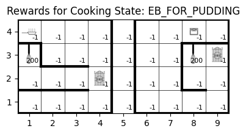
    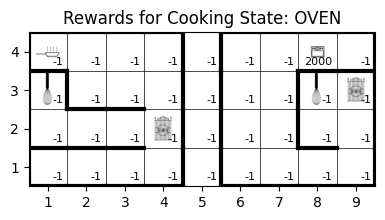

### 5. Discount Factor
The better discount factor found for the implementation is $$\gamma = 0.7$$ It is the results of meny experiments done during the development of the project.

---

## Implementation Details

This section describes the implementation of the most important parts of the project.

### Environment Class

The project is composed of two main classes: the **Environment** class and the **Agent** class. The **Environment** class represents the model as described in the previous chapter. It defines and exposes two key methods for the agent's use:

- **`get_episode_start_state`**: Returns the starting state for an episode based on the specified recipe and spawn point.
- **`get_next_state`**: Returns the next state given the current state and the chosen action.

Additionally, a Policy Iteration algorithm based on the Bellman matrix is implemented. This algorithm is used to compare the policy computed by the agent with the optimal one, providing insights in the results section. For example, with the current state equal to, respectively, `EB_FOR_PUDDING` and `OVEN`, the optimal policy is:

    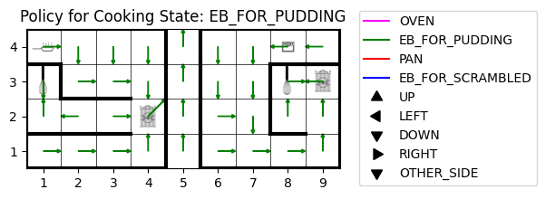
    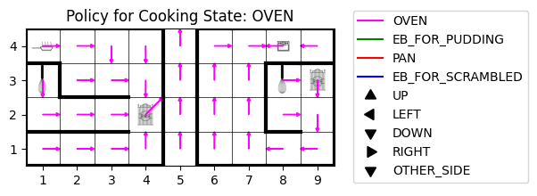

### Agent Class

The **Agent** class includes two main methods for computing the optimal policy:

* **`generate_episode`**: This method generates an episode given a starting state and a policy. It interacts with the environment only to retrieve the starting state and the next state. However, the action is selected based on the provided policy.

* **`incremental_mc_epsilon_greedy`**: This method derives the optimal policy starting from an initial policy, which is initialized using the epsilon-greedy technique. The method iterates until convergence, which occurs when there are no changes in the policy between consecutive iterations.

---

### Challenges and Solutions

This section discusses the main challenges faced during the development process and the solutions implemented to address them.

### 1. Episode Generation

Generating effective episodes for learning presented several challenges. Two critical factors had to be addressed: **episode length** and **starting state**.

- **Episode Length**:  
  Determining an appropriate episode length was crucial for efficient learning. After conducting experiments and trials, it was found that the optimal episode length for the environment (given the map described earlier) ranges between **300 and 500** steps.

- **Starting State**:  
  Using "more advanced" spawn points relative to the problem's actual starting point significantly accelerated learning. To implement this, the `get_episode_start_state` method was designed to return a starting state chosen as follows:
  - **x, y**: Any position on the map.
  - **CS**: A state related to the recipe being prepared. For example:
    - If the recipe is "Pudding," the CS could be `EG_FOR_PUDDING` or `OVEN`.

  This dynamic starting approach made learning more efficient by allowing episodes to reach their goals faster, especially during the early stages of the Monte Carlo algorithm, when the agent's primary task is exploration. As shown in the results, this method significantly outperformed the initial approach.

### 2. Epsilon Decay

One significant issue encountered was overly rapid convergence of the algorithm. The problem was traced back to an excessively fast decay of epsilon ($\epsilon$). 

- **Initial Decay**:  
  Initially, epsilon decayed as:
  $$
  \epsilon = \frac{1}{i}
  $$
  where $i$ is the current episode number. This caused the algorithm to converge after only 100–230 episodes, which was too few for adequate exploration.

- **Improved Decay**:  
  To encourage exploration and improve the learning process, a slower decay was introduced by incorporating a decay factor $k$:
  $$
  \epsilon = \frac{1}{i^k}
  $$
  After experimenting with various values for $k$, the best tradeoff between execution duration and performance was found at **$k=0.25$**.

This discovery, combined with the mixed spawn approach, led to a final solution where the policy closely resembled the optimal one.

---

## Results and Evaluation

This section presents the results obtained from the implementation of the Monte Carlo learning algorithm for the Cooking Chef Problem. It evaluates the performance of the agent in achieving an optimal policy, discusses key findings, and provides visual evidence to support the conclusions.

---

#### **1. Evaluation of Policy Convergence**

The implementation of the **incremental Monte Carlo epsilon-greedy algorithm** demonstrated a clear progression toward the optimal policy. Through fine-tuning parameters such as $\gamma = 0.7$ and the epsilon decay ($\epsilon = 1/i^{0.25}$), the agent achieved significant improvements in policy performance:
- The convergence rate was optimized to balance exploration and exploitation.
- The final policy closely resembled the optimal policy derived via policy iteration, with only minor deviations (e.g., in some states, the agent chose equivalent but different actions, such as moving right instead of down).

This is the final optimal policy obtained from the Monte Carlo algorithm with the random spawn state for the states `EB_FOR_PUDDING` and `OVEN`:

    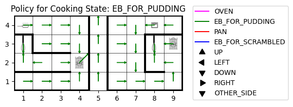
    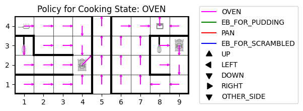

As you can see, it is really near to the optimal policy calculated with the policy iteration:

    
    

#### **2. Impact of the Dynamic Spawn approach**

The success rate of the agent improved significantly when using a random spawn point. The policy optained with a fixed spawn point is:

    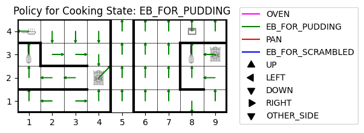
    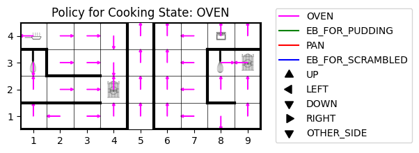

Unlike the fixed spawn point configuration, where the goal rate stagnated at **0%**, the dynamic approach led to an average **goal achievement rate of 70%** across episodes. As you can graphically see, the policy is quite far from the optimal one computed with the policy iteration. This was validated by comparing the **Rolling Success Ratio** between the two approaches, that in the random spawn approach steadily increased as more episodes were processed, reflecting the agent's improved ability to navigate and achieve goals, while in the fixed spawn approach is always zero.

    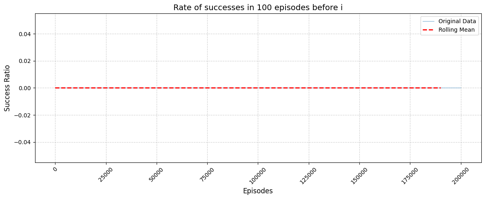
    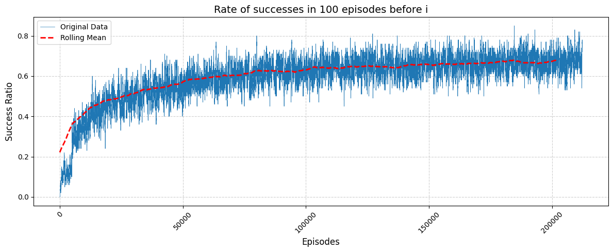

<em>Rate of success with fixed spawn (up) and dynamic spawn (down)</em>

#### **3. Impact of Epsilon Decay**

The results highlighted the importance of the epsilon decay rate:
- A slower decay (e.g., $k=0.25$) allowed for extensive exploration in the early stages, preventing premature convergence.
- Adjusting the decay parameter balanced execution time (approximately **24 minutes**) and policy performance. A further reduction in decay speed could yield better results but at the cost of longer execution times.

Before the implementation of the decay factor and the advanced spawn, the results were obtained after approximately 100–200 episodes. The resulting "optimal policy" for the states `EB_FOR_PUDDING` and `OVEN` was as follows:

    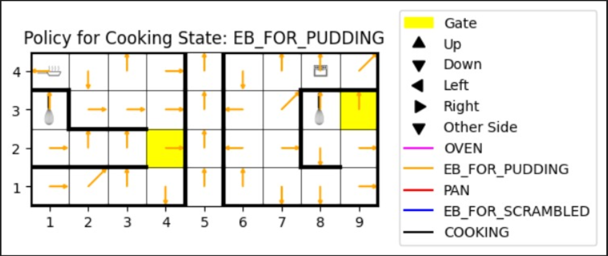
    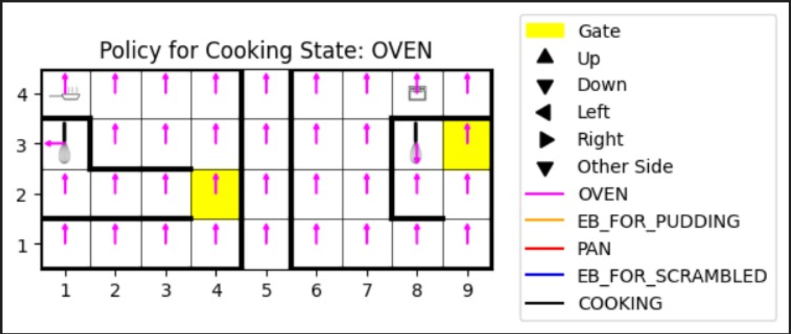

It is evident that the `OVEN` state was not explored at all, as the agent failed to adequately explore the map.

#### Conclusion

The Monte Carlo epsilon-greedy algorithm, enhanced with dynamic spawn points and optimized epsilon decay, delivered a policy nearly indistinguishable from the optimal policy. While execution time and decay speed present a trade-off, the current configuration achieves a strong balance, enabling robust learning within reasonable time constraints.
